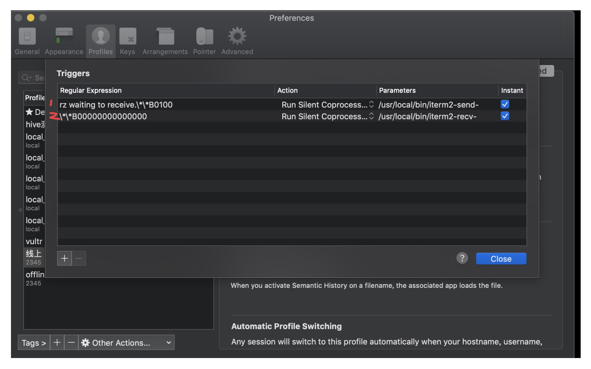

#iterm2-zmodem 项目介绍

* 在mac下，实现与服务器进行便捷的文件上传和下载操作

#步骤
* 在本地/usr/local/bin/(建议)目录下保存iterm2-send-zmodem.sh 和iterm2-recv-zmodem.sh两个脚本
* 设置一下两个脚本的权限，一般 chmod 777 就行

```bash
chmod -x iterm2-send-zmodem.sh iterm2-recv-zmodem.sh 或者 chmod 777 iterm2-send-zmodem.sh iterm2-recv-zmodem.sh

```

* 配置iterm2  Preferences ->  Profiles  ->  当前使用的配置  ->   Advanced

| Regular expression                         | Action           |                Parameters                |                Instant                |
| :------------------------------ | :------------------- | :----------------------------------: | :----------------------------------: |
| rz waiting to receive.\*\*B0100 | Run Silent Coprocess | iterm2-send-zmodem.sh文件所在位置      | checked                              |
| \*\*B00000000000000 | Run Silent Coprocess | iterm2-recv-zmodem.sh文件所在位置      | checked                              |

* 如下图所示




* 注意：
- MAC 本地需要安装 lrzsz
`brew install lrzsz`

